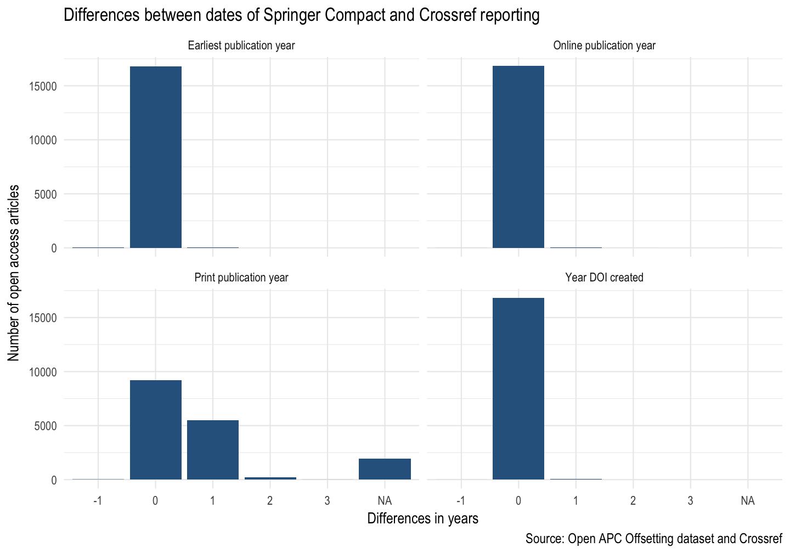

## About

Test whether year of offsetting reporting to the [Open APC Initiative](https://github.com/openapc/openapc-de) and Crossref differs.

## Results

Differences between Springer Compact reporting and Crossref dates (by year)


```r
library(tidyverse)
#' analysis
oapc_df <- readr::read_csv("cr_dates_apc_yearly_diffs.csv")
oapc_df %>% 
  gather(`Earliest publication year`:`Online publication year`, key = "type", value = "yearly_diff") %>%
  ggplot(aes(as.factor(yearly_diff))) + 
  geom_bar(fill = "#30638E") +
  facet_wrap(~ type) +
  labs(x = "Differences in years",
       y = "Number of open access articles",
       title = "Differences between dates of Springer Compact and Crossref reporting",
       caption = "Source: Open APC Offsetting dataset and Crossref") +
  theme_minimal(base_family="Arial Narrow", base_size = 14)
```



Proportion of articles with no time difference (year)


```r
oapc_df %>% 
  gather(`Earliest publication year`:`Online publication year`, key = "type", value = "yearly_diff") %>%
  group_by(type) %>%
  count(yearly_diff) %>%
  mutate(prop = n / nrow(oapc_df)) %>%
  filter(yearly_diff == 0) %>%
  knitr::kable()
```


|type                      | yearly_diff|     n|      prop|
|:-------------------------|-----------:|-----:|---------:|
|Earliest publication year |           0| 16809| 0.9949686|
|Online publication year   |           0| 16831| 0.9962709|
|Print publication year    |           0|  9178| 0.5432698|
|Year DOI created          |           0| 16829| 0.9961525|

## Data and methods

All steps to fetch the metadata using R are available in [`cr_dates.R`](cr_dates.R). 

There are three datasets: [`oapc_data-csv`](oapc_data-csv) is the snapshot of the APC data used.


```r
readr::read_csv("oapc_data.csv")
#> # A tibble: 16,906 x 18
#>    institution  period euro  doi     is_hybrid publisher journal_full_tit…
#>    <chr>         <int> <chr> <chr>   <lgl>     <chr>     <chr>            
#>  1 Aberystwyth…   2015 <NA>  10.100… T         Springer… Soft Computing   
#>  2 Aberystwyth…   2016 <NA>  10.100… T         Springer… Geoheritage      
#>  3 Aberystwyth…   2016 <NA>  10.100… T         Springer… Studies in Philo…
#>  4 Aberystwyth…   2016 <NA>  10.100… T         Springer… Language Policy  
#>  5 Aberystwyth…   2016 <NA>  10.100… T         Springer… Conservation Gen…
#>  6 Aberystwyth…   2016 <NA>  10.100… T         Springer… Sports Medicine  
#>  7 Anglia Rusk…   2016 <NA>  10.100… T         Springer… Journal of Autis…
#>  8 Anglia Rusk…   2016 <NA>  10.100… T         Springer… Experimental Bra…
#>  9 Anglia Rusk…   2016 <NA>  10.100… T         Springer… Morphology       
#> 10 Anglia Rusk…   2016 <NA>  10.100… T         Springer… The Internationa…
#> # ... with 16,896 more rows, and 11 more variables: issn <chr>,
#> #   issn_print <chr>, issn_electronic <chr>, issn_l <chr>,
#> #   license_ref <chr>, indexed_in_crossref <lgl>, pmid <int>, pmcid <chr>,
#> #   ut <chr>, url <chr>, doaj <lgl>
```

[`cr_dates.csv`](cr_dates.csv) contains the Crossref results after querying Crossref API. For twelve records, no metadata could be obtained.


```r
readr::read_csv("cr_dates.csv")
#> # A tibble: 16,894 x 5
#>    doi        created             published_print published_online issued 
#>    <chr>      <dttm>              <chr>           <chr>            <chr>  
#>  1 10.1007/s… 2015-11-17 08:57:27 2016-8          2015-11-17       2015-1…
#>  2 10.1007/s… 2016-01-19 07:07:29 2016-12         2016-1-19        2016-1…
#>  3 10.1007/s… 2016-03-18 17:30:15 2016-5          2016-3-18        2016-3…
#>  4 10.1007/s… 2016-03-04 03:45:04 2017-5          2016-3-4         2016-3…
#>  5 10.1007/s… 2016-04-26 06:55:12 2016-9          2016-4-26        2016-4…
#>  6 10.1007/s… 2016-05-31 12:54:07 2017-1          2016-5-31        2016-5…
#>  7 10.1007/s… 2016-01-20 05:58:54 2016-5          2016-1-20        2016-1…
#>  8 10.1007/s… 2016-02-15 11:23:38 2016-6          2016-2-15        2016-2…
#>  9 10.1007/s… 2016-04-14 10:47:40 2016-5          2016-4-13        2016-4…
#> 10 10.1007/s… 2016-04-19 15:52:44 2016-7          2016-4-19        2016-4…
#> # ... with 16,884 more rows
```

Finally, [`cr_dates_apc_yearly_diffs.csv`](cr_dates_apc_yearly_diffs.csv) is a spreadsheet with calculated yearly differences used for the analysis.

## Bugs

Please report bugs or send improvements via the [issue tracker](https://github.com/njahn82/cr_dates/issues).


## License

This repository and all contributions to it are released into the public domain.

Anyone is free to copy, modify, publish, use, compile, sell, or distribute these materials in any form, for any purpose, commercial or non-commercial, and by any means.

Crossref asserts no claims of ownership to individual items of bibliographic metadata and associated Digital Object Identifiers (DOIs) acquired through the use of the Crossref Free Services. Individual items of bibliographic metadata and associated DOIs may be cached and incorporated into the user's content and systems.

Open APC Data are made available under the Open Database License: <http://opendatacommons.org/licenses/odbl/1.0/>. Any rights in individual contents of the database are licensed under the Database Contents License: <http://opendatacommons.org/licenses/dbcl/1.0/>.


